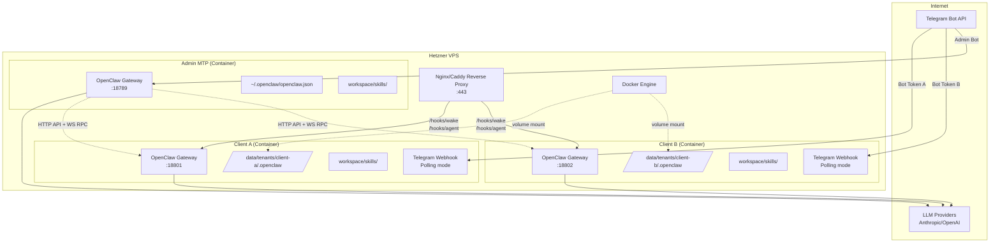

# OpenClaw Multi-Tenant SaaS Architecture — Decision Document

**Project:** MyTechPlan (MTP) — Agents-as-a-Service
**Date:** 2026-02-14
**Status:** Research complete, validated against source code
**Repo analyzed:** `openclaw/openclaw` (commit `b1dd23f61`)

---

## 1. Architecture Diagram (Validated)



---

## 2. Hypothesis Verdicts

### H1: Container-per-client isolation — CONFIRMED

**Evidence:**

- **All state paths are env-configurable** (`src/config/paths.ts`):
  - `OPENCLAW_HOME` — base home directory
  - `OPENCLAW_STATE_DIR` — state dir (default: `~/.openclaw`)
  - `OPENCLAW_CONFIG_PATH` — config file path
  - `OPENCLAW_GATEWAY_PORT` — gateway port (default: 18789)

- **Gateway lock is per-config-path** (`src/infra/gateway-lock.ts:167-173`): Lock file path is derived from SHA1 hash of config path: `$TMPDIR/openclaw-$UID/gateway.<hash>.lock`. Different containers = different config paths = different locks. Plus: `OPENCLAW_ALLOW_MULTI_GATEWAY=1` skips locking entirely.

- **No shared state or cross-container dependencies**: Each container has its own config, sessions (JSONL files), auth profiles (JSON), workspace. No shared database, no Redis, no message broker.

- **Dockerfile** (`Dockerfile:42-48`): Runs as non-root `node` user (UID 1000). Default CMD: `gateway --allow-unconfigured`. Binds to loopback by default.

- **docker-compose.yml** already shows the pattern:
  ```yaml
  volumes:
    - ${OPENCLAW_CONFIG_DIR}:/home/node/.openclaw
    - ${OPENCLAW_WORKSPACE_DIR}:/home/node/.openclaw/workspace
  ports:
    - "${OPENCLAW_GATEWAY_PORT:-18789}:18789"
  ```

- **mDNS/Bonjour discovery** (`src/gateway/server-discovery.ts`) exists but is LAN-based and purely optional — advertising for the Control UI to find gateways. Separate containers on separate ports pose no conflict.

**Verdict: Clean isolation. Zero code changes needed.**

---

### H2: Telegram webhook mode per-container — CONFIRMED

**Evidence:**

- **Polling is the default** (`src/telegram/monitor.ts:91-217`): `monitorTelegramProvider()` starts polling via `@grammyjs/runner` unless `useWebhook: true` is explicitly set.

- **Webhook mode is fully supported** (`src/telegram/webhook.ts`): `startTelegramWebhook()` creates an HTTP server, calls `bot.api.setWebhook(publicUrl, ...)`, and listens on configurable `host:port/path`.

- **Per-account webhook config** (`src/config/types.telegram.ts:110-114`):
  ```typescript
  webhookUrl?: string;      // Public URL for Telegram to send updates to
  webhookSecret?: string;   // Shared secret for webhook verification
  webhookPath?: string;     // Path on the local HTTP server
  webhookHost?: string;     // Bind host for webhook listener
  ```

- **Multi-account Telegram** (`src/telegram/accounts.ts`): `channels.telegram.accounts` is a `Record<string, TelegramAccountConfig>`. Each account has its own token, webhook config, and settings. The gateway starts a separate bot per enabled account.

- **Config validation** (`src/config/zod-schema.providers-core.ts:173-180`): `webhookUrl` requires `webhookSecret` (enforced at config validation level).

**Recommendation for MTP:** Use **polling mode** (default, no webhook setup needed). Each container gets its own bot token. Polling is simpler for multi-tenant because:
- No need to expose each container's webhook port to the internet
- No need for a reverse proxy routing webhook URLs to correct containers
- No SSL certificate management per container
- Polling just works behind NAT, firewalls, etc.
- Telegram rate limits are per-bot-token anyway

If you later need webhooks (lower latency): each container can run its own webhook listener, and you route via Nginx/Caddy path-based routing.

**Verdict: Both polling and webhook work per-container. Use polling for MVP.**

---

### H3: Admin API interaction with client containers — CONFIRMED

**Evidence:**

- **WebSocket RPC methods** (`src/gateway/server-methods-list.ts`): 85+ methods available including:
  - `config.get`, `config.set`, `config.patch`, `config.apply` — full remote config management
  - `agent` — run an agent (send message to AI)
  - `send` — send a message to a channel
  - `chat.send`, `chat.history`, `chat.abort` — WebChat-style chat
  - `agents.list`, `agents.create`, `agents.update`, `agents.delete` — CRUD agents
  - `skills.status`, `skills.install`, `skills.update` — skill management
  - `sessions.list`, `sessions.preview`, `sessions.patch`, `sessions.reset`, `sessions.delete`
  - `health` — health status
  - `channels.status`, `channels.logout` — channel management
  - `cron.*` — scheduled task management
  - `models.list` — available models
  - `usage.status`, `usage.cost` — usage tracking

- **HTTP endpoints** (`src/gateway/server-http.ts`):
  - `/hooks/wake` — wake the agent (POST, requires hook token)
  - `/hooks/agent` — send a message to the agent (POST, returns runId)
  - `/api/channels/*` — channel-specific HTTP handlers (Slack events, etc.)
  - `/v1/chat/completions` — OpenAI-compatible chat API (when `openAiChatCompletionsEnabled`)
  - `/v1/responses` — OpenAI Responses API compatible (when `openResponsesEnabled`)
  - Control UI routes — web dashboard
  - Canvas/A2UI routes — live canvas
  - `/healthz` — health check (on webhook listener)

- **Authentication** (`src/gateway/auth.ts`):
  - `OPENCLAW_GATEWAY_TOKEN` env var or `gateway.auth.token` config — bearer token auth
  - `OPENCLAW_GATEWAY_PASSWORD` env var or `gateway.auth.password` config — password auth
  - Tailscale auth — when exposed via Tailscale serve
  - `trusted-proxy` mode — for reverse proxy setups with user headers
  - Auth supports rate limiting (`src/gateway/auth-rate-limit.ts`)
  - Loopback requests bypass auth when no auth mode is set

- **Hooks system** (`src/gateway/hooks.ts`): Configurable HTTP webhook endpoint for external integrations. Can trigger agent runs, wake events, with custom hook mappings.

**Admin → Client interaction pattern:**
1. Connect via WebSocket with gateway token
2. Use RPC methods (`config.patch`, `agent`, `skills.install`, etc.)
3. Or use HTTP hooks API for fire-and-forget agent triggers

**Verdict: Full programmatic control. Admin can manage everything remotely.**

---

### H4: Skills isolation and sandbox — CONFIRMED (with nuances)

**Evidence:**

- **Sandbox system exists** (`src/agents/sandbox/`): OpenClaw has a full Docker-based sandbox system:
  - `sandbox.mode`: `"off"` | `"non-main"` | `"all"` (per agent or global default)
  - `sandbox.docker.image`: custom Docker image for sandbox (default: `Dockerfile.sandbox`)
  - Sandbox containers are created per-session or per-agent (`scope`: `"session"` | `"agent"` | `"shared"`)
  - `sandbox.docker.readOnlyRoot: true` by default
  - Workspace access: `"rw"` | `"ro"` | `"none"` (configurable per agent)

- **Sandbox Docker containers** (`src/agents/sandbox/docker.ts`): Spawns `docker create` with:
  - Read-only root filesystem
  - tmpfs mounts for `/tmp`, `/var/tmp`, `/run`
  - No network by default (`network: "none"`)
  - Resource limits (ulimits, memory)
  - Workspace mounted as volume

- **In container-per-client model**: The Docker container IS the isolation boundary. Each client's gateway runs in its own container with its own filesystem. Skills can't access other containers' files. This is sufficient for the MTP use case.

- **Skills loading** (`src/agents/skills-install.ts`, `src/plugins/`): Skills are directories in the workspace (`workspace/skills/`) or global config entries. They run inside the same Node.js process (when sandbox is off) or in Docker sandbox containers (when sandbox is on).

- **Bash tool execution** (`src/agents/bash-tools.exec.ts`): Agent can execute shell commands. When sandbox mode is enabled, these run inside the sandbox container. When sandbox is off, they run in the gateway's process.

**For MTP multi-tenant:**
- Container-per-client = filesystem isolation by Docker
- Enable `sandbox.mode: "all"` in client configs for defense-in-depth (agent shell commands run in a nested sandbox container)
- This means Docker-in-Docker — the client container needs Docker socket access, which has security implications
- **Alternative**: just rely on container isolation (simpler, no DinD) and restrict dangerous tools via `tools.deny`

**Verdict: Container boundary provides tenant isolation. Optional nested sandbox for defense-in-depth.**

---

### H5: Bot creation automation — PARTIALLY CONFIRMED

**Evidence:**

- **BotFather has NO programmatic API** — bot creation via `/newbot` command in Telegram chat with @BotFather is the ONLY way. There is no REST API for creating bots.

- **OpenClaw has NO provisioning automation** for Telegram bot creation.

- **What CAN be automated** after manual bot creation:
  - `setWebhook` / `deleteWebhook` calls (OpenClaw does this: `src/telegram/webhook-set.ts`)
  - Bot configuration via config file generation
  - Bot username and description changes via Bot API (`setMyName`, `setMyDescription`)
  - Adding bot to groups via Telegram API

**Minimum manual steps per client:**
1. Open Telegram → @BotFather → `/newbot` → set name → get token (~30 seconds)
2. Create Telegram group → add bot → add client

**Everything else can be automated** (config generation, container provisioning, etc.)

**Verdict: Bot creation is manual (~30sec/client). Everything else is scriptable.**

---

### H6: Docker lifecycle management — CONFIRMED

**Evidence:**

- OpenClaw has no built-in Docker management skills, BUT:
- The coding agent (`agents.defaults.sandbox`) can execute shell commands including `docker compose`
- Admin MTP can manage client containers via:
  - Shell skills running `docker compose up/down/restart`
  - Direct Docker API calls from a management script
  - Standard Docker Compose orchestration

**Security consideration:** If Admin MTP's agent can access Docker socket, it can control all containers. This is intentional for the admin role but must be carefully secured:
- Mount Docker socket only in Admin container
- Never in client containers
- Use Docker TLS for remote management if needed

**Verdict: Admin can manage Docker lifecycle. Use Docker Compose + scripts, not the AI agent.**

---

### H7: Config template generation — CONFIRMED

**Evidence:**

- Config is JSON5 (`src/config/io.ts`) — supports comments, trailing commas, unquoted keys
- **`${ENV_VAR}` substitution IS supported** (`src/config/env-substitution.ts`): Use `${UPPERCASE_VAR}` in string values. Only uppercase vars (`[A-Z_][A-Z0-9_]*`). Escape with `$${VAR}`. Config writer restores `${VAR}` references on save (won't leak resolved secrets).
- **`$include` IS supported** (`src/config/includes.ts`): Deep-merge multiple config files. Syntax: `"$include": "./base.json5"` or `"$include": ["./a.json5", "./b.json5"]`. Max 10 levels deep.
- `models: {}` is the **ONLY required field** — everything else is optional with sensible defaults.

**Minimum viable `openclaw.json` for a tenant with Telegram:**

```json5
{
  // Only required field (can even be empty object)
  "models": {
    "primary": "anthropic/claude-sonnet-4-5-20250929"
  },
  // Telegram — botToken can use ${ENV_VAR} substitution
  "channels": {
    "telegram": {
      "enabled": true,
      "accounts": {
        "default": {
          "botToken": "${TELEGRAM_BOT_TOKEN}",
          "dmPolicy": "open",
          "groupPolicy": "open"
        }
      }
    }
  },
  // Agent config
  "agents": {
    "defaults": {
      "model": {
        "primary": "anthropic/claude-sonnet-4-5-20250929"
      }
    }
  },
  // Gateway auth (token resolved from env)
  "gateway": {
    "auth": {
      "token": "${OPENCLAW_GATEWAY_TOKEN}"
    }
  }
}
```

- Bot token also accepted via `TELEGRAM_BOT_TOKEN` env var directly (`src/telegram/token.ts`)
- Auth profiles for LLM providers stored in `~/.openclaw/credentials/oauth.json`
- **Per-model cost config** (`cost: { input, output, cacheRead, cacheWrite }`) available for billing calculations
- **OpenTelemetry** support via `diagnostics.otel` config (traces, metrics, logs via http/protobuf or gRPC)

**Verdict: Config is simple JSON5. Template approach works perfectly with env var injection.**

---

### H8: Resource footprint per container — ESTIMATED

**Evidence (code analysis, not runtime measurement):**

- **Dependencies**: 40+ runtime deps including grammY, Express 5, sharp, pdfjs-dist, playwright-core, ws, sqlite-vec, undici
- **Base Node.js process**: ~80-120MB RAM idle (Node 22 + V8 heap)
- **With Telegram polling + agent idle**: ~150-200MB estimated (grammY runner, express server, WebSocket server)
- **Per active chat**: +50-100MB temporarily (LLM streaming, context management)
- **Docker overhead**: ~10-20MB per container (cgroups, namespaces)

**Conservative estimate per idle tenant: ~200MB RAM, <0.1 CPU core**

| VPS Size | RAM | Estimated Idle Tenants | Active Tenants (concurrent) |
|----------|-----|----------------------|---------------------------|
| CX22 (4GB) | 4GB | ~10-15 | 3-5 |
| CX32 (8GB) | 8GB | ~25-30 | 8-12 |
| CX42 (16GB) | 16GB | ~55-65 | 15-25 |
| CX52 (32GB) | 32GB | ~120-130 | 30-50 |

**Important caveats:**
- These are idle estimates. Active LLM calls spike CPU/RAM
- sharp (image processing) can spike memory
- Memory leaks not assessed (would need runtime profiling)
- Swap can help with idle containers

**Recommendation for MVP (10-20 clients): CX32 (8GB) Hetzner = ~€8/month**

**Verdict: ~200MB/idle tenant. 8GB VPS handles 20+ tenants comfortably.**

---

## 3. Architecture Gaps

### Health endpoint
- **Telegram webhook listener** has `/healthz` → returns 200 "ok" (`src/telegram/webhook.ts:59-63`)
- **Gateway WebSocket** has `health` RPC method (`src/gateway/server-methods/health.ts`)
- **No standalone `/health` HTTP endpoint** on the main gateway HTTP server
- **Workaround**: Use the WS `health` method, or add a simple health route (trivial PR)
- Docker health check: `docker exec <container> node -e "fetch('http://127.0.0.1:18789/').then(r => process.exit(r.status === 404 ? 0 : 1))"`

### Usage metering / billing
- **`usage.status`** and **`usage.cost`** RPC methods exist (`src/gateway/server-methods-list.ts:10-11`)
- Session logs are JSONL files under `~/.openclaw/agents/<agentId>/sessions/*.jsonl` — parseable for token counts
- **No built-in webhook/callback for per-request usage events**
- **Approach**: Periodically poll `usage.cost` via WS RPC, or parse session JSONL files for token counts

### Backup strategy
**Critical files per tenant (in the volume mount):**
- `openclaw.json` — config (source of truth)
- `credentials/oauth.json` — LLM provider OAuth tokens
- `agents/<id>/sessions/*.jsonl` — conversation history
- `workspace/skills/` — installed skills
- `sessions/` — session store

**Backup**: Volume-level snapshots (Hetzner volumes support snapshots) or rsync

### Update strategy
- Pull new image: `docker pull ghcr.io/openclaw/openclaw:main`
- Rolling restart: `docker compose up -d --no-deps <service>` per tenant
- Gateway handles SIGTERM gracefully (`src/gateway/server-close.ts`): closes channels, stops cron, broadcasts `shutdown` event to WS clients with optional `restartExpectedMs`
- WebSocket clients receive shutdown event with restart ETA

---

## 4. Minimum Viable docker-compose.yml (2 tenants + admin)

```yaml
# docker-compose.mtp.yml
version: "3.8"

x-openclaw-base: &openclaw-base
  image: ghcr.io/openclaw/openclaw:main
  init: true
  restart: unless-stopped
  environment: &base-env
    HOME: /home/node
    TERM: xterm-256color
    NODE_ENV: production

services:
  # ─── Admin MTP Instance ───
  admin:
    <<: *openclaw-base
    container_name: mtp-admin
    environment:
      <<: *base-env
      OPENCLAW_GATEWAY_TOKEN: ${ADMIN_GATEWAY_TOKEN}
      TELEGRAM_BOT_TOKEN: ${ADMIN_TELEGRAM_TOKEN}
      # Admin's LLM auth
      ANTHROPIC_API_KEY: ${ADMIN_ANTHROPIC_KEY}
    volumes:
      - ./data/admin/.openclaw:/home/node/.openclaw
      - ./data/admin/workspace:/home/node/.openclaw/workspace
      # Docker socket for container management (ADMIN ONLY)
      - /var/run/docker.sock:/var/run/docker.sock:ro
    ports:
      - "18789:18789"
    command: ["node", "dist/index.js", "gateway", "--bind", "lan", "--port", "18789"]

  # ─── Client A ───
  client-a:
    <<: *openclaw-base
    container_name: mtp-client-a
    environment:
      <<: *base-env
      OPENCLAW_GATEWAY_TOKEN: ${CLIENT_A_GATEWAY_TOKEN}
      TELEGRAM_BOT_TOKEN: ${CLIENT_A_TELEGRAM_TOKEN}
      ANTHROPIC_API_KEY: ${CLIENT_A_ANTHROPIC_KEY}
      # Client-specific integrations
      NOTION_API_KEY: ${CLIENT_A_NOTION_KEY}
      HUBSPOT_TOKEN: ${CLIENT_A_HUBSPOT_TOKEN}
      SMTP_HOST: ${CLIENT_A_SMTP_HOST}
      SMTP_USER: ${CLIENT_A_SMTP_USER}
      SMTP_PASS: ${CLIENT_A_SMTP_PASS}
    volumes:
      - ./data/client-a/.openclaw:/home/node/.openclaw
      - ./data/client-a/workspace:/home/node/.openclaw/workspace
    ports:
      - "18801:18789"
    command: ["node", "dist/index.js", "gateway", "--bind", "lan", "--port", "18789"]

  # ─── Client B ───
  client-b:
    <<: *openclaw-base
    container_name: mtp-client-b
    environment:
      <<: *base-env
      OPENCLAW_GATEWAY_TOKEN: ${CLIENT_B_GATEWAY_TOKEN}
      TELEGRAM_BOT_TOKEN: ${CLIENT_B_TELEGRAM_TOKEN}
      ANTHROPIC_API_KEY: ${CLIENT_B_ANTHROPIC_KEY}
      NOTION_API_KEY: ${CLIENT_B_NOTION_KEY}
    volumes:
      - ./data/client-b/.openclaw:/home/node/.openclaw
      - ./data/client-b/workspace:/home/node/.openclaw/workspace
    ports:
      - "18802:18789"
    command: ["node", "dist/index.js", "gateway", "--bind", "lan", "--port", "18789"]
```

**.env file:**
```env
ADMIN_GATEWAY_TOKEN=generate-a-random-token-admin
ADMIN_TELEGRAM_TOKEN=from-botfather-admin
ADMIN_ANTHROPIC_KEY=sk-ant-...

CLIENT_A_GATEWAY_TOKEN=generate-a-random-token-a
CLIENT_A_TELEGRAM_TOKEN=from-botfather-a
CLIENT_A_ANTHROPIC_KEY=sk-ant-...
CLIENT_A_NOTION_KEY=secret_...
CLIENT_A_HUBSPOT_TOKEN=pat-...
CLIENT_A_SMTP_HOST=smtp.gmail.com
CLIENT_A_SMTP_USER=client-a@company.com
CLIENT_A_SMTP_PASS=app-password

CLIENT_B_GATEWAY_TOKEN=generate-a-random-token-b
CLIENT_B_TELEGRAM_TOKEN=from-botfather-b
CLIENT_B_ANTHROPIC_KEY=sk-ant-...
CLIENT_B_NOTION_KEY=secret_...
```

---

## 5. Provisioning Script Pseudocode

```bash
#!/bin/bash
# provision-tenant.sh <client-id> <telegram-bot-token> <anthropic-key>

CLIENT_ID=$1
BOT_TOKEN=$2
ANTHROPIC_KEY=$3
GATEWAY_TOKEN=$(openssl rand -hex 32)
PORT=$(next_available_port)  # 18801, 18802, ...

# 1. Create directory structure
mkdir -p data/$CLIENT_ID/.openclaw/credentials
mkdir -p data/$CLIENT_ID/workspace/skills

# 2. Generate config
cat > data/$CLIENT_ID/.openclaw/openclaw.json <<EOF
{
  "models": { "primary": "anthropic/claude-sonnet-4-5-20250929" },
  "channels": {
    "telegram": {
      "enabled": true,
      "accounts": {
        "default": {
          "dmPolicy": "open",
          "groupPolicy": "open"
        }
      }
    }
  },
  "agents": {
    "defaults": {
      "model": { "primary": "anthropic/claude-sonnet-4-5-20250929" }
    }
  },
  "gateway": {
    "auth": { "mode": "token" }
  }
}
EOF

# 3. Add to .env
cat >> .env <<EOF
${CLIENT_ID^^}_GATEWAY_TOKEN=$GATEWAY_TOKEN
${CLIENT_ID^^}_TELEGRAM_TOKEN=$BOT_TOKEN
${CLIENT_ID^^}_ANTHROPIC_KEY=$ANTHROPIC_KEY
EOF

# 4. Add service to docker-compose override
cat >> docker-compose.override.yml <<EOF
  $CLIENT_ID:
    image: ghcr.io/openclaw/openclaw:main
    container_name: mtp-$CLIENT_ID
    init: true
    restart: unless-stopped
    environment:
      HOME: /home/node
      OPENCLAW_GATEWAY_TOKEN: \${${CLIENT_ID^^}_GATEWAY_TOKEN}
      TELEGRAM_BOT_TOKEN: \${${CLIENT_ID^^}_TELEGRAM_TOKEN}
      ANTHROPIC_API_KEY: \${${CLIENT_ID^^}_ANTHROPIC_KEY}
    volumes:
      - ./data/$CLIENT_ID/.openclaw:/home/node/.openclaw
      - ./data/$CLIENT_ID/workspace:/home/node/.openclaw/workspace
    ports:
      - "$PORT:18789"
    command: ["node", "dist/index.js", "gateway", "--bind", "lan", "--port", "18789"]
EOF

# 5. Start container
docker compose up -d $CLIENT_ID

# 6. Wait for startup
sleep 5

# 7. Verify health (via WS or process check)
docker exec mtp-$CLIENT_ID node -e "
  const ws = new (require('ws'))('ws://127.0.0.1:18789');
  ws.on('open', () => { console.log('OK'); ws.close(); process.exit(0); });
  ws.on('error', () => process.exit(1));
  setTimeout(() => process.exit(1), 5000);
"

echo "Tenant $CLIENT_ID provisioned on port $PORT"
echo "Gateway token: $GATEWAY_TOKEN"
```

---

## 6. Risk Register

| Risk | Likelihood | Impact | Mitigation |
|------|-----------|--------|------------|
| **OpenClaw breaking update** | High (releases frequently) | High — all tenants affected | Pin image tag to specific commit/release. Test updates on staging first. |
| **Memory leak in gateway** | Medium | High — container OOM | Set `--max-old-space-size` in Node, Docker memory limits, monitoring |
| **Client's Telegram bot gets rate-limited** | Low (own bot per client) | Medium | Each client has own token. Monitor 429 responses. |
| **LLM provider outage** | Medium | High — all clients down | Configure failover auth profiles (multiple providers per client) |
| **Docker socket exposure in admin** | Low (read-only mount) | Critical | Use `:ro`, restrict admin access, consider Docker TLS |
| **Config file corruption** | Low | High per-tenant | Volume snapshots, config validation on write (Zod schema) |
| **Client exhausts LLM credits** | Medium | Medium | Monitor `usage.cost` RPC, set billing alerts at provider level |
| **Port conflicts on host** | Low | Low | Use dynamic port allocation in provisioning script |
| **Telegram webhook conflict** | N/A (using polling) | N/A | Use polling mode; no webhook conflicts possible |
| **Session data grows unbounded** | Medium | Medium — disk fill | `sessions.compact` RPC method exists, set up periodic cleanup |

---

## 7. Manual Steps Inventory

| Step | Automatable? | Time | Frequency |
|------|-------------|------|-----------|
| Create Telegram bot via BotFather | **NO** | ~30 sec | Per new client |
| Create Telegram group | Yes (Bot API) | Instant | Per new client |
| Add bot to group | Yes (Bot API) | Instant | Per new client |
| Add client to group | Partially (invite link) | ~10 sec | Per new client |
| Set up LLM auth (Anthropic API key) | **Semi-manual** — client provides key or MTP uses shared key | Varies | Per new client |
| Generate config + provision container | **Yes** (script) | ~10 sec | Per new client |
| Install custom skills | **Yes** (via `skills.install` RPC) | ~30 sec | On demand |
| Update OpenClaw version | **Yes** (`docker pull` + rolling restart) | ~2 min | Per release |
| Monitor health | **Yes** (health checks + alerts) | Continuous | Always |

**Total manual onboarding time per client: ~1-2 minutes** (mostly BotFather + adding user to group)

---

## 8. Recommended Tech Stack (Management Layer)

| Component | Recommendation | Why |
|-----------|---------------|-----|
| **Orchestration** | Docker Compose | Simple, no K8s needed for <50 tenants |
| **Reverse proxy** | Caddy | Auto-HTTPS, simple config, health checks |
| **Secrets** | Docker secrets + `.env` files | Simple, file-based (matches OpenClaw's model) |
| **Monitoring** | Uptime Kuma (self-hosted) | Free, simple health checks, alerts to Telegram |
| **Logging** | Docker JSON logs + Loki (optional) | `docker logs mtp-client-a` for debugging |
| **Backup** | Hetzner Volume Snapshots + rsync | Volume-level backup, automated |
| **Provisioning** | Bash scripts (→ later: small Node/Python CLI) | Keep it simple for MVP |
| **Billing/metering** | Poll `usage.cost` RPC + spreadsheet (MVP) | Build proper billing later |
| **VPS** | Hetzner CX32 (8GB, €8/mo) | Handles 20+ idle tenants |
| **DNS** | Cloudflare (free tier) | Proxy + wildcard DNS |

---

## 9. Key Configuration Reference (from source code)

### Environment Variables for Containers

| Env Var | Purpose | Source |
|---------|---------|--------|
| `OPENCLAW_GATEWAY_TOKEN` | Bearer token for WS/HTTP auth | `src/gateway/auth.ts:200` |
| `OPENCLAW_GATEWAY_PASSWORD` | Password auth (alternative to token) | `src/gateway/auth.ts:201` |
| `OPENCLAW_GATEWAY_PORT` | Override gateway port | `src/config/paths.ts:261` |
| `OPENCLAW_HOME` | Override home directory | `src/infra/home-dir.ts:18` |
| `OPENCLAW_STATE_DIR` | Override state directory | `src/config/paths.ts:65` |
| `OPENCLAW_CONFIG_PATH` | Override config file path | `src/config/paths.ts:119` |
| `OPENCLAW_ALLOW_MULTI_GATEWAY` | Skip gateway lock (=1) | `src/infra/gateway-lock.ts:182` |
| `TELEGRAM_BOT_TOKEN` | Telegram bot token (default account) | `src/telegram/token.ts` |
| `ANTHROPIC_API_KEY` | Anthropic API key | Used by auth profiles |

### Gateway RPC Methods (key ones for admin)

| Method | Purpose |
|--------|---------|
| `config.get` | Read current config |
| `config.patch` | Patch config fields |
| `config.apply` | Apply full config |
| `agent` | Run agent with message |
| `send` | Send message to channel |
| `health` | Get health status |
| `skills.install` | Install a skill |
| `skills.status` | List installed skills |
| `usage.cost` | Get LLM usage/cost |
| `sessions.list` | List active sessions |
| `channels.status` | Get channel health |

---

## 10. Next Steps for MVP

1. **Set up Hetzner VPS** (CX32, 8GB RAM)
2. **Install Docker + Docker Compose**
3. **Create the provisioning script** (based on pseudocode above)
4. **Create 1 test tenant** manually to validate the full flow
5. **Set up Caddy** for HTTPS + reverse proxy (if exposing Control UI)
6. **Set up Uptime Kuma** for health monitoring
7. **Create Admin MTP instance** with management skills
8. **Onboard first real client**
9. **Build billing tracking** (poll `usage.cost` daily, store in SQLite/spreadsheet)
