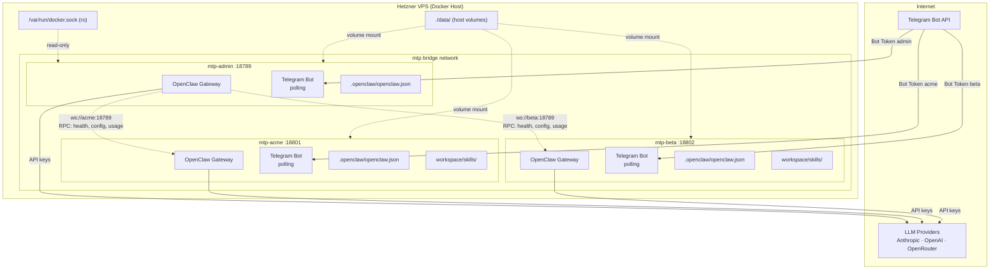

# MTP SaaS — Multi-Tenant OpenClaw Infrastructure

Multi-tenant Docker Compose infrastructure for running OpenClaw instances as agents-as-a-service. Each client gets their own isolated container with a dedicated Telegram bot, LLM credentials, and workspace — fully separated from other tenants.

---

## Architecture



### Key points

- **Container-per-tenant isolation**: each tenant has its own process, filesystem, credentials, and Telegram bot. No shared state.
- **Telegram polling mode**: outbound-only connections — no webhooks, no SSL certs, no reverse proxy. Works behind NAT.
- **Admin-only Docker socket**: mounted read-only. Tenant containers have zero Docker access.
- **Internal networking**: admin reaches tenants via Docker DNS (`ws://<tenant>:18789`), no host port needed for inter-container communication.
- **Host ports are optional**: exposed for direct external access (debugging, monitoring), but not required for operation.

---

## Prerequisites

- Docker Engine 24+ with Docker Compose v2
- Linux server with 4GB+ RAM (Hetzner CX22+ recommended)
- Telegram bot token(s) from [@BotFather](https://t.me/BotFather)
- At least one LLM API key (Anthropic, OpenAI, or OpenRouter)
- `bash`, `openssl`, `tar`, `sed` (standard on any Linux server)

---

## Quick Start

```bash
# 1. Copy and fill in admin credentials
cp .env.example .env
#    Set: ADMIN_GATEWAY_TOKEN, ADMIN_TELEGRAM_TOKEN, ADMIN_ANTHROPIC_KEY

# 2. Create admin data directory + config
mkdir -p data/admin/.openclaw data/admin/workspace
cp config/tenant-template.json5 data/admin/.openclaw/openclaw.json

# 3. Start admin
docker compose up -d admin

# 4. Verify admin is healthy
docker inspect --format='{{.State.Health.Status}}' mtp-admin
#    → "healthy"

# 5. Provision your first tenant
./provision-tenant.sh acme 7123456789:AAFxxx sk-ant-api03-xxx

# 6. Check everything
./status.sh
```

---

## Development Phases

### Phase 1 — Local Validation (Day 1)

Get a single admin + one tenant running on your dev machine.

| Step | Command | Validates |
|------|---------|-----------|
| Build or pull the OpenClaw image | `docker pull ghcr.io/openclaw/openclaw:main` | Image is accessible |
| Configure `.env` | `cp .env.example .env` + fill in values | Env var structure works |
| Start admin | `docker compose up -d admin` | Compose file is valid, health check passes |
| Provision one tenant | `./provision-tenant.sh test-1 <token> <key>` | Full provisioning flow end-to-end |
| Send a Telegram message | DM the tenant's bot | Gateway + Telegram polling + LLM round-trip |
| Check status | `./status.sh` | Status script reads container state |
| Remove tenant | `./remove-tenant.sh test-1` | Teardown + backup works |

### Phase 2 — Server Deployment (Day 2-3)

Deploy to a Hetzner VPS and validate with real clients.

| Step | Detail |
|------|--------|
| Provision VPS | Hetzner CX32 (8GB RAM, ~8 EUR/mo), install Docker |
| Clone repo | `git clone` + `cd mtp/` |
| Configure admin | `.env` with production keys |
| Start admin | `docker compose up -d admin` |
| Provision 2-3 test tenants | One per team member with their own bot |
| Verify isolation | Confirm tenants can't see each other's messages/sessions |
| Test update flow | `./update.sh --no-pull` (rolling restart) |
| Test backup/restore | `./backup.sh` + delete + re-provision + restore data dir |

### Phase 3 — First Real Clients (Week 1-2)

Onboard paying clients with proper monitoring.

| Step | Detail |
|------|--------|
| Onboard 3-5 clients | `provision-tenant.sh` per client |
| Install custom skills | Edit each tenant's config or use admin RPC |
| Set up monitoring | Uptime Kuma (self-hosted) hitting each container's health check |
| Set up backup cron | `crontab -e` → `0 3 * * * /path/to/mtp/backup.sh` |
| Track usage | Poll `usage.cost` RPC per tenant weekly |

### Phase 4 — Scale & Harden (Month 1+)

| Step | Detail |
|------|--------|
| Pin image tags | `OPENCLAW_IMAGE=ghcr.io/openclaw/openclaw:v2025.x.y` |
| Add Docker memory limits | `deploy.resources.limits.memory: 512m` per tenant |
| Automated billing | Script that polls `usage.cost` and logs to SQLite/spreadsheet |
| Second VPS | When approaching 20+ tenants, provision another host |
| Caddy reverse proxy | If exposing Control UI per tenant over HTTPS |

---

## Testing Checklist

Run through this before deploying to production.

### Scripts

- [ ] `provision-tenant.sh` — creates dirs, config, .env entries, override YAML, starts container
- [ ] `provision-tenant.sh` — rejects duplicate tenant name
- [ ] `provision-tenant.sh` — rejects "admin" as tenant name
- [ ] `provision-tenant.sh` — rejects invalid names (uppercase, spaces, special chars)
- [ ] `provision-tenant.sh` — port auto-increments correctly with multiple tenants
- [ ] `remove-tenant.sh` — stops container, cleans .env, cleans tenants.conf
- [ ] `remove-tenant.sh --keep-data` — stops container but preserves data dir
- [ ] `remove-tenant.sh` — creates final backup before deleting data
- [ ] `status.sh` — shows admin + all tenants with correct status
- [ ] `status.sh --json` — outputs valid JSON
- [ ] `backup.sh` — creates timestamped .tar.gz in backups/
- [ ] `backup.sh <name>` — backs up only the specified tenant
- [ ] `backup.sh --list` — lists existing backups with sizes
- [ ] `update.sh` — pulls image + rolling restart, all containers come back healthy
- [ ] `update.sh --image <tag>` — uses the specified image (not the default)
- [ ] `update.sh --no-pull` — skips docker pull, just restarts

### Docker Compose

- [ ] `docker compose config` — renders valid YAML with 0 tenants
- [ ] `docker compose config` — renders valid YAML with 1+ tenants
- [ ] Admin container starts and becomes healthy within 30s
- [ ] Tenant container starts and becomes healthy within 30s
- [ ] Admin container has Docker socket mounted (read-only)
- [ ] Tenant containers do NOT have Docker socket
- [ ] Container logs rotate (max 50MB x 3 files)
- [ ] Containers restart automatically after `docker restart`

### Tenant Isolation

- [ ] Tenant A cannot read Tenant B's files (different volume mounts)
- [ ] Tenant A's Telegram bot only receives its own messages
- [ ] Tenant A's gateway token does not work on Tenant B's gateway
- [ ] Removing Tenant A does not affect Tenant B

### Telegram Integration

- [ ] Bot responds to DMs in polling mode
- [ ] Bot responds in group chats when mentioned
- [ ] Bot reconnects after container restart
- [ ] Long messages are chunked correctly

### Operations

- [ ] Backup + delete data + re-provision + restore = working tenant
- [ ] Rolling update keeps at least some tenants available during restart
- [ ] `docker compose logs -f <tenant>` shows useful output
- [ ] Health check correctly reports unhealthy when gateway is down

---

## Admin Dashboard

Web-based admin panel for monitoring and managing tenants remotely. Deployed on Vercel.

**URL:** https://admin-neon-beta.vercel.app
**Auth:** Password-based (JWT cookie)
**Source:** `mtp/admin/`

### Features

| Feature | Status | Description |
|---------|--------|-------------|
| **Login** | ✅ | Password auth with JWT cookies |
| **Tenant overview** | ✅ | Dashboard with tenant cards |
| **File tree** | ✅ | Navigable folder structure per tenant (collapsible dirs) |
| **File editor** | ✅ | View/edit any file, save commits to GitHub |
| **Cron jobs** | ✅ | View all scheduled jobs with expandable details |
| **Logs** | 🔜 | Placeholder — requires tunnel for real-time access |

### How it works

- Reads/writes tenant files via **GitHub API** (repos `MyTechPlan/taas-{tenant}`)
- Cron jobs read from `.openclaw/cron/jobs.json` snapshots committed to repos
- No direct Docker access needed — works from anywhere
- Auto-detects repo structure (`workspace/` prefix vs root)

### Tech Stack

- Next.js 14 (App Router) + Tailwind CSS
- Octokit (GitHub API) for file operations
- Dark theme, responsive

### Env vars (Vercel)

| Variable | Description |
|----------|-------------|
| `ADMIN_PASSWORD` | Login password |
| `JWT_SECRET` | Secret for signing auth tokens |
| `GITHUB_TOKEN` | GitHub PAT with repo access to `MyTechPlan/taas-*` |

### Adding a new tenant to the dashboard

Edit `lib/tenants.ts` and add the tenant to the config array:

```typescript
{ id: 'newtenant', name: 'NewTenant', repo: 'MyTechPlan/taas-newtenant' }
```

Then redeploy: `cd mtp/admin && vercel --prod`

### Roadmap

- **Logs tab**: Real-time container logs via Cloudflare Tunnel or session transcript viewer
- **Cron editing**: CRUD operations via Gateway API (requires tunnel)
- **Container status**: Health, uptime, memory usage
- **Usage/billing**: LLM token usage and cost tracking per tenant

---

## Directory Structure

```
mtp/
├── docker-compose.yml          # Base compose (admin service + YAML anchors)
├── docker-compose.override.yml # Auto-generated tenant services (gitignored)
├── .env                        # Secrets (gitignored)
├── .env.example                # Template for .env
├── tenants.conf                # Registry: "name port" per line (gitignored)
├── config/
│   └── tenant-template.json5   # Base OpenClaw config for new tenants
├── data/                       # Per-tenant runtime data (gitignored)
│   ├── admin/
│   │   ├── .openclaw/          # Config, sessions, credentials, agents
│   │   └── workspace/          # Skills, workspace files
│   └── <tenant>/               # Same structure per tenant
├── backups/                    # Timestamped .tar.gz archives (gitignored)
│
├── admin/                      # Admin Dashboard (Next.js, deployed on Vercel)
│   ├── app/                    # Pages + API routes
│   ├── components/             # React components (TenantDetail, FileEditor, etc.)
│   ├── lib/                    # GitHub API, auth, tenant config
│   └── package.json
│
├── provision-tenant.sh         # Add a new tenant (full lifecycle)
├── remove-tenant.sh            # Remove a tenant (with backup)
├── status.sh                   # Show all container status
├── backup.sh                   # Backup tenant data
├── update.sh                   # Update image + rolling restart
└── _generate-override.sh       # Internal: rebuilds override YAML from tenants.conf
```

---

## Scripts Reference

### provision-tenant.sh

```bash
./provision-tenant.sh <tenant-name> <telegram-bot-token> [anthropic-key]

# Examples:
./provision-tenant.sh acme   7123456789:AAFxxx  sk-ant-api03-xxx
./provision-tenant.sh beta   7987654321:BBGyyy  sk-ant-api03-yyy
```

What it does:
1. Validates tenant name (lowercase alphanumeric + hyphens, no "admin")
2. Generates a 256-bit gateway token (`openssl rand -hex 32`)
3. Picks the next available port (base: 18801, auto-increments)
4. Creates `data/<name>/.openclaw/` directory tree
5. Copies `config/tenant-template.json5` as the tenant's config
6. Appends env vars to `.env` (prefix: `<UPPER_NAME>_*`)
7. Registers in `tenants.conf`
8. Regenerates `docker-compose.override.yml`
9. Starts the container via `docker compose up -d`
10. Waits up to 60s for health check
11. Prints connection details

### remove-tenant.sh

```bash
./remove-tenant.sh <tenant-name>              # backup + remove data
./remove-tenant.sh <tenant-name> --keep-data  # keep data directory
```

### status.sh

```bash
./status.sh          # formatted table: name, container, port, status, uptime, health, memory
./status.sh --json   # JSON array for scripting
```

### backup.sh

```bash
./backup.sh                 # backup all tenants + admin
./backup.sh <tenant-name>   # backup one tenant
./backup.sh --list          # list existing backups with sizes
```

### update.sh

```bash
./update.sh                                    # pull latest image + rolling restart
./update.sh --image ghcr.io/openclaw/openclaw:v2025.2.13   # pin to specific tag
./update.sh --no-pull                          # restart containers without pulling
```

Always creates a pre-update backup automatically.

---

## Environment Variables

### Admin

| Variable | Required | Description |
|----------|----------|-------------|
| `OPENCLAW_IMAGE` | No | Docker image (default: `ghcr.io/openclaw/openclaw:main`) |
| `ADMIN_GATEWAY_TOKEN` | **Yes** | Bearer token for admin gateway auth |
| `ADMIN_TELEGRAM_TOKEN` | No | Admin's Telegram bot token |
| `ADMIN_ANTHROPIC_KEY` | No | Admin's Anthropic API key |
| `ADMIN_OPENAI_KEY` | No | Admin's OpenAI API key |
| `ADMIN_OPENROUTER_KEY` | No | Admin's OpenRouter API key |
| `ADMIN_PORT` | No | Host port (default: 18789) |

### Per-tenant (auto-generated by provision script)

Prefix = uppercase tenant name, hyphens → underscores. E.g., `client-a` → `CLIENT_A_*`.

| Variable | Required | Description |
|----------|----------|-------------|
| `<PREFIX>_GATEWAY_TOKEN` | **Yes** | Auto-generated, required for container startup |
| `<PREFIX>_TELEGRAM_TOKEN` | **Yes** | From @BotFather, required for container startup |
| `<PREFIX>_ANTHROPIC_KEY` | No | Anthropic API key |
| `<PREFIX>_OPENAI_KEY` | No | OpenAI API key |
| `<PREFIX>_OPENROUTER_KEY` | No | OpenRouter API key |
| `<PREFIX>_PORT` | No | Host port (auto-assigned) |

---

## Tenant Config

Base template: `config/tenant-template.json5`

Edit the template to change defaults for **new** tenants. Existing tenants keep their config at `data/<name>/.openclaw/openclaw.json`.

Key settings:

| Setting | Default | Options |
|---------|---------|---------|
| `channels.telegram.accounts.default.dmPolicy` | `"open"` | `"open"`, `"pairing"` (approval flow), `"allowlist"` |
| `channels.telegram.accounts.default.groupPolicy` | `"open"` | `"open"`, `"allowlist"`, `"disabled"` |
| `channels.telegram.accounts.default.streamMode` | `"partial"` | `"off"`, `"partial"`, `"block"` |
| `models.primary` | `anthropic/claude-sonnet-4-5-20250929` | Any supported model ID |

Secrets use env var substitution: `"token": "${OPENCLAW_GATEWAY_TOKEN}"` resolves at runtime from the container's environment.

---

## Admin API

Admin can manage tenants remotely via WebSocket RPC on the internal Docker network:

```
ws://acme:18789  (using acme's GATEWAY_TOKEN as bearer auth)
```

| RPC Method | Purpose |
|------------|---------|
| `health` | Check gateway + channel status |
| `config.get` | Read tenant config |
| `config.patch` | Modify tenant config live (hot-reload) |
| `agent` | Send a message to the tenant's AI agent |
| `send` | Send a message to a channel |
| `usage.cost` | Get LLM usage and cost data |
| `sessions.list` | List active conversation sessions |
| `channels.status` | Check Telegram connection health |
| `skills.install` | Install a skill remotely |
| `skills.status` | List installed skills |

---

## Onboarding a New Client

| Step | Time | Automated? |
|------|------|------------|
| 1. Create Telegram bot via @BotFather `/newbot` | ~30s | Manual |
| 2. Get LLM API key (client provides, or use shared key) | varies | Manual |
| 3. Run `./provision-tenant.sh <name> <token> <key>` | ~30s | Script |
| 4. Create Telegram group, add bot + client | ~30s | Manual |
| 5. Customize config (optional) | ~2min | Manual |
| 6. Install skills (optional) | ~1min | RPC or manual |

**Total: ~2-5 minutes per client.**

---

## Resource Estimates

~200MB RAM per idle tenant. Active LLM calls spike temporarily.

| VPS | RAM | Monthly Cost | Idle Tenants | Active (concurrent) |
|-----|-----|-------------|-------------|-------------------|
| CX22 | 4 GB | ~4 EUR | 10-15 | 3-5 |
| CX32 | 8 GB | ~8 EUR | 25-30 | 8-12 |
| CX42 | 16 GB | ~16 EUR | 55-65 | 15-25 |
| CX52 | 32 GB | ~30 EUR | 120-130 | 30-50 |

**Recommendation for MVP (10-20 clients): CX32 (8GB).**
